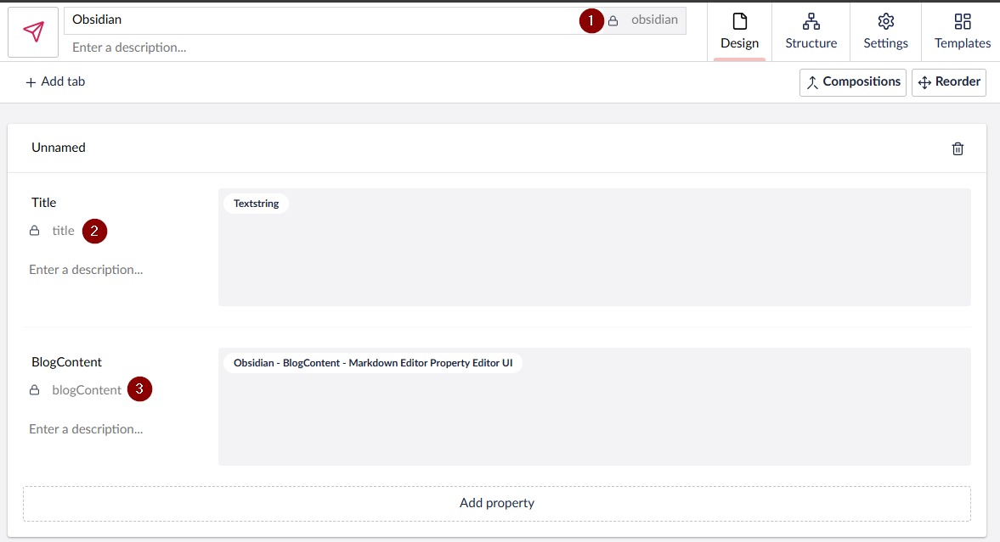
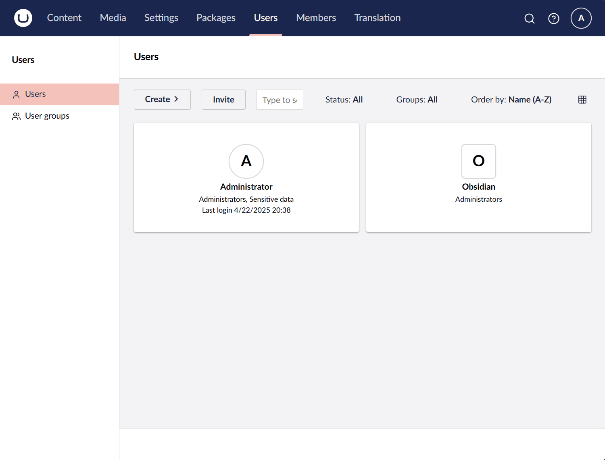

</img> 
# Umbracidian - a plugin for Obsidian

This plugin allows you to push your [Obsidian](https://obsidian.md/) notes to [Umbraco 15+](https://umbraco.com) as a blog post. 

This plugin is currently awaiting PR to be added as an "official" plugin, but in the mean time, you can manually add this plugin to your Obsidian install copying over main.js, manifest.json to your vault folder `VaultFolder/.obsidian/plugins/umbracidian/`

You can get the files from the [latest release](https://github.com/OwainWilliams/Umbracidian/releases/tag/1.0.0) or copy the powershell script `getLatest.ps1` in to your plugins folder `/plugins/umbracidian` and run the script. This will download the latest manifest and javascript files for you. (Thanks Paul Seal for the suggestion)

If you get an error when running the powershell script in Terminal, you may need to run Terminal as an Admin and run `set-executionpolicy remotesigned` 

## Usage

### Setup Umbraco Document Type

Within Umbraco, you need to create a new document type for your blog posts. This document type should have the following properties as a minimum:
   - Title (string)
   - BlogContent (MarkdownEditor)
Make a note of the alias of the document type and also the alias of the properties. e.g. `obsidian`, `title`, `blogContent`. 

### Setup API user

Within Umbraco, you will need to create a new API user. 

   -  Go to Users > Create API user
   - Give the user a name and email address
   - Give the user a User Group
	- Once saved, go to the user and create Client Credentials. These are what are used when Obsidian connects to Umbraco.
	- You shouldnt use this account to log in to the backoffice, this is for API use only.

### Setup Umbracian

>[!Note]
> Remeber to give your blog document type permission to either post on the root node or the parent node you are using.

1. Website Url - this is the base URL of your umbraco site e.g https://owain.codes
1. Client ID - this is setup within Umbraco when you create the API user
1. Client Secret - this is setup within Umbraco when you create the API user
1. Blog Parent Node UUID - this is the parent node in Umbraco where your blog posts will be created under. You can find this by going to the content tree and clicking on the node. Leave blank if posting to root node. 
1. DocType Alias - this is the alias of the document type you created in Umbraco for your blog posts. e.g. `obsidian`
1. Title Alias - this is the alias of the title property you created in Umbraco for your blog posts. e.g. `title`
1. Blog Content Editor Alias - this is the alias of the blog content property you created in Umbraco for your blog posts. e.g. `blogContent`

### Pushing to Umbraco

Once everything is setup, you should now be able to push your content to Umbraco. It's important to make sure that you have clicked on the page you want to push. It's not enough to just open the note on to the screen. Place your cursor on the note, otherwise you will get a message saying `No active Markdown view found`

You can either click on the plugin icon on the left hand side menu or you can use the command palete. The command you need for the command palete is `Umbracidian: Push to Umbraco command` or just start typing `Umbrac` and the command will appear in the palette. Remember - you need to have the cursor on the note. 
